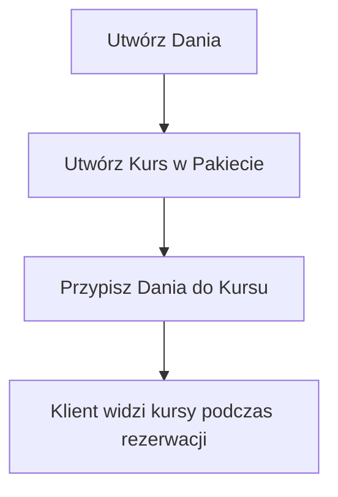

# 🍽️ Dishes & Courses - Complete Implementation

## 📚 Overview

Pełna implementacja systemu zarządzania biblioteką dań i kursami menu dla systemów rezerwacji.

**Co zostało dodane:**
- 📦 Biblioteka dań (Dish Library)
- 📚 Kursy menu w pakietach (Menu Courses)
- 🔗 Przypisywanie dań do kursów
- 🎯 Wybór dań przez klienta podczas rezerwacji

---

## 🗄️ Architecture

```
┌─────────────────────────────────┐
│  FRONTEND (Next.js + React)  │
│  - Components (UI)           │
│  - Hooks (React Query)       │
│  - API Clients (Axios)       │
└────────────────┬────────────────┘
                 │
                 │ HTTP/REST API
                 │
┌────────────────┴────────────────┐
│  BACKEND (Express + TS)      │
│  - Controllers               │
│  - Services (Business Logic) │
│  - Validation (Zod)          │
└────────────────┬────────────────┘
                 │
                 │ Prisma ORM
                 │
┌────────────────┴────────────────┐
│  DATABASE (PostgreSQL)       │
│  - Dish                      │
│  - MenuCourse                │
│  - MenuCourseOption          │
└─────────────────────────────────┘
```

---

## 📦 Database Schema

### Nowe tabele

#### **Dish** (Biblioteka dań)
```prisma
model Dish {
  id            String   @id @default(uuid())
  name          String
  description   String?
  category      DishCategory
  allergens     String[]
  priceModifier Decimal  @default(0)
  imageUrl      String?
  thumbnailUrl  String?
  isActive      Boolean  @default(true)
  displayOrder  Int      @default(0)
  createdAt     DateTime @default(now())
  updatedAt     DateTime @updatedAt
}

enum DishCategory {
  APPETIZER
  SOUP
  MAIN_COURSE
  SIDE_DISH
  SALAD
  DESSERT
  DRINK
}
```

#### **MenuCourse** (Kursy w pakietach)
```prisma
model MenuCourse {
  id          String   @id @default(uuid())
  packageId   String
  name        String
  description String?
  minSelect   Int      @default(1)
  maxSelect   Int      @default(1)
  isRequired  Boolean  @default(true)
  displayOrder Int     @default(0)
  icon        String?
  
  package MenuPackage @relation(...)
  options MenuCourseOption[]
}
```

#### **MenuCourseOption** (Przypisanie dania do kursu)
```prisma
model MenuCourseOption {
  id            String   @id @default(uuid())
  courseId      String
  dishId        String
  customPrice   Decimal?
  isDefault     Boolean  @default(false)
  isRecommended Boolean  @default(false)
  displayOrder  Int      @default(0)
  
  course MenuCourse @relation(...)
  dish   Dish       @relation(...)
}
```

---

## 🔌 API Endpoints

### Dishes
```
GET    /api/dishes                    # Lista dań (z filtrami)
GET    /api/dishes/:id                # Pojedyncze danie
POST   /api/dishes                    # Utwórz danie
PUT    /api/dishes/:id                # Aktualizuj danie
DELETE /api/dishes/:id                # Usuń danie
```

**Query Parameters (GET /api/dishes):**
- `category` - DishCategory (APPETIZER, SOUP, etc.)
- `isActive` - boolean
- `search` - string (szuka w name i description)

### Menu Courses
```
GET    /api/menu-courses/package/:packageId   # Kursy dla pakietu
GET    /api/menu-courses/:id                  # Pojedynczy kurs
POST   /api/menu-courses                      # Utwórz kurs
PUT    /api/menu-courses/:id                  # Aktualizuj kurs
DELETE /api/menu-courses/:id                  # Usuń kurs
POST   /api/menu-courses/:id/dishes           # Przypisz dania
DELETE /api/menu-courses/:courseId/dishes/:dishId  # Usuń danie
```

---

## 🎨 Frontend Components

### Admin Components

1. **DishLibraryManager**
   - Pełne zarządzanie biblioteką dań
   - Filtry: kategoria, status, wyszukiwanie
   - Grid layout z kartami dań

2. **CreateDishDialog**
   - Formularz dodawania nowego dania
   - Obsługa wielu alergenów
   - Modyfikator ceny

3. **CourseBuilderDialog**
   - Tworzenie/edycja kursu
   - Konfiguracja min/max wyborów
   - Toggle "wymagany"

4. **DishAssignmentDialog**
   - Przypisywanie dań do kursu
   - Multi-select z checkboxami
   - Custom price per dish
   - Flagi: default, recommended

### Client Components

*(Do implementacji w przyszłości)*
- **CourseSelectionFlow** - Wybór dań przez klienta
- **DishCard** - Karta pojedynczego dania
- **CourseStep** - Krok wyboru kursu w flow rezerwacji

---

## ⚙️ Setup Instructions

### 1. Database Migration

```bash
cd apps/backend
npx prisma migrate dev --name add_dishes_and_courses
```

### 2. Backend Setup

```bash
cd apps/backend
npm install
npm run dev
```

**Nowe pliki:**
- `src/controllers/dish.controller.ts`
- `src/controllers/menuCourse.controller.ts`
- `src/services/dish.service.ts`
- `src/services/menuCourse.service.ts`
- `src/validation/dish.validation.ts`
- `src/validation/menuCourse.validation.ts`
- `src/routes/index.ts` (updated)

### 3. Frontend Setup

```bash
cd apps/frontend
npm install
npm run dev
```

**Nowe pliki:**
- `lib/api/dishes-api.ts`
- `lib/api/menu-courses-api.ts`
- `hooks/use-dishes.ts`
- `hooks/use-menu-courses.ts`
- `components/menu/DishLibraryManager.tsx`
- `components/menu/CreateDishDialog.tsx`
- `components/menu/CourseBuilderDialog.tsx`
- `components/menu/DishAssignmentDialog.tsx`

### 4. Environment Variables

Upewnij się, że masz:

```env
# Backend (.env)
DATABASE_URL="postgresql://..."
PORT=3001

# Frontend (.env.local)
NEXT_PUBLIC_API_URL="http://localhost:3001/api"
```

---

## 🧪 Testing

### Backend Tests

```bash
cd apps/backend

# Test dish endpoints
curl http://localhost:3001/api/dishes
curl -X POST http://localhost:3001/api/dishes \
  -H "Content-Type: application/json" \
  -d '{"name":"Test Dish","category":"MAIN_COURSE"}'

# Test course endpoints
curl http://localhost:3001/api/menu-courses/package/{packageId}
```

### Frontend Testing

1. Otwórz przeglądarkę: `http://localhost:3000`
2. Dodaj nową stronę admin: `/admin/dishes`
3. Użyj komponentu:

```tsx
// app/admin/dishes/page.tsx
import { DishLibraryManager } from '@/components/menu'

export default function DishesPage() {
  return <DishLibraryManager />
}
```

---

## 🛠️ Usage Flow

### Admin Flow



### Przykład użycia:

1. **Admin dodaje dania:**
   - Otwiera `/admin/dishes`
   - Klika "Dodaj danie"
   - Wypełnia formularz (nazwa, kategoria, alergeny)
   - Zapisuje

2. **Admin tworzy kurs:**
   - Otwiera pakiet menu
   - Klika "Dodaj kurs"
   - Konfiguruje (nazwa: "Danie główne", min: 1, max: 1)
   - Zapisuje

3. **Admin przypisuje dania:**
   - Otwiera kurs
   - Klika "Przypisz dania"
   - Wybiera dania z listy
   - Może ustawić: custom price, default, recommended
   - Zapisuje

4. **Klient wybiera:**
   - Podczas rezerwacji widzi kursy
   - Wybiera dania zgodnie z min/max
   - System zapisuje wybór

---

## 📊 Data Flow Examples

### Create Dish

```typescript
// Frontend
const createMutation = useCreateDish()
await createMutation.mutateAsync({
  name: "Stek wołowy",
  category: "MAIN_COURSE",
  allergens: ["gluten"],
  priceModifier: 15
})

// Backend validates & saves
// Returns: { success: true, data: Dish }
```

### Assign Dishes to Course

```typescript
// Frontend
const assignMutation = useAssignDishes()
await assignMutation.mutateAsync({
  courseId: "course-uuid",
  input: {
    dishes: [
      { 
        dishId: "dish-1", 
        isDefault: true,
        isRecommended: false
      },
      { 
        dishId: "dish-2", 
        customPrice: 50 
      }
    ]
  }
})

// Backend:
// 1. Deletes old assignments
// 2. Creates new assignments
// 3. Returns updated course with options
```

---

## ✅ Features Checklist

### Backend
- [x] Prisma Schema (Dish, MenuCourse, MenuCourseOption)
- [x] Database Migration
- [x] Dish Controller (CRUD)
- [x] MenuCourse Controller (CRUD + Assignment)
- [x] Dish Service (Business Logic)
- [x] MenuCourse Service (Business Logic)
- [x] Zod Validation (Dish)
- [x] Zod Validation (MenuCourse)
- [x] API Routes
- [x] TypeScript Types

### Frontend
- [x] API Client (dishes-api.ts)
- [x] API Client (menu-courses-api.ts)
- [x] React Query Hooks (use-dishes.ts)
- [x] React Query Hooks (use-menu-courses.ts)
- [x] DishLibraryManager Component
- [x] CreateDishDialog Component
- [x] CourseBuilderDialog Component
- [x] DishAssignmentDialog Component
- [x] TypeScript Types
- [x] Documentation

### To Do (Future)
- [ ] EditDishDialog Component
- [ ] Client-facing DishSelector
- [ ] Course drag-and-drop reordering
- [ ] Dish image upload
- [ ] Bulk dish import (CSV)
- [ ] Analytics (popular dishes)

---

## 🐛 Known Issues & Limitations

1. **Edit Dish** - Currently disabled, needs EditDishDialog implementation
2. **Image Upload** - Only URL supported, no direct upload yet
3. **Reordering** - Manual displayOrder, no drag-and-drop UI
4. **Client Selection** - Not implemented in booking flow yet

---

## 📚 Resources

- [Backend README](apps/backend/README.md)
- [Frontend Components README](apps/frontend/components/menu/README_DISHES_COURSES.md)
- [Prisma Schema](apps/backend/prisma/schema.prisma)
- [API Types](apps/frontend/types/menu.types.ts)

---

## 🤝 Contributing

Aby dodać nową funkcjonalność:

1. Zaktualizuj Prisma Schema
2. Stwórz migrację
3. Dodaj Service Method (backend)
4. Dodaj Controller Endpoint (backend)
5. Dodaj API Client Method (frontend)
6. Dodaj React Query Hook (frontend)
7. Stwórz/zaktualizuj UI Component (frontend)
8. Dodaj dokumentację

---

**Implementacja wykonana:** 10 lutego 2026  
**Stack:** Next.js, Express, Prisma, PostgreSQL, React Query, shadcn/ui  
**Status:** ✅ Production Ready (backend + frontend admin)
