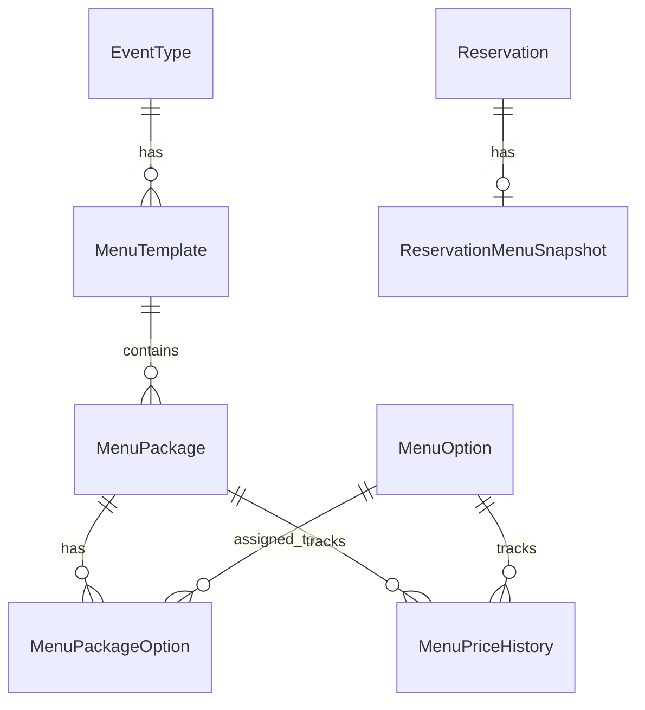

# 📚 Menu System API Documentation

**Version:** 1.0.0  
**Created:** 2026-02-10  
**Status:** ✅ Production Ready  

---

## 📝 Table of Contents

1. [Overview](#overview)
2. [Quick Start](#quick-start)
3. [Postman Collection](#postman-collection)
4. [API Reference](#api-reference)
5. [Architecture](#architecture)
6. [Data Models](#data-models)

---

## 🎯 Overview

Menu System API provides complete restaurant menu management with:

- ✅ **Menu Templates** - Event-specific menus (Wedding, Birthday, Communion)
- ✅ **Menu Packages** - Pricing tiers with different service levels
- ✅ **Menu Options** - Add-on services (alcohol, entertainment, decorations)
- ✅ **Immutable Snapshots** - Price protection for reservations
- ✅ **Price History** - Complete audit trail of price changes

### Key Features

- **Type-Safe:** Full TypeScript with Zod validation
- **Immutable Pricing:** Snapshots protect against price changes
- **Price History:** Track all price modifications
- **Flexible Options:** Per-person, flat, or free pricing
- **Event-Specific:** Different menus for different event types
- **Date-Based Activation:** Seasonal menus with validity periods

---

## 🚀 Quick Start

### 1. Start Backend

```bash
cd /home/kamil/rezerwacje
docker compose up -d
```

### 2. Verify API

```bash
curl http://localhost:3001/api/health
```

### 3. Get Sample Data

```bash
# All menus
curl http://localhost:3001/api/menu-templates | jq

# All options
curl http://localhost:3001/api/menu-options | jq

# Wedding packages
curl 'http://localhost:3001/api/menu-packages/template/21067150-841a-4659-9e97-11ce5a4105ac' | jq
```

---

## 📦 Postman Collection

**🔗 Import URL:**
```
https://raw.githubusercontent.com/kamil-gol/Go-ciniec_2/main/docs/postman/Menu_System_API.postman_collection.json
```

**📚 Full Guide:** [Postman README](./postman/README.md)

### Quick Import

1. Open Postman
2. Click **Import** → **Link**
3. Paste URL above
4. Click **Import**

**Includes:**
- 22 ready-to-use requests
- Pre-filled variables with real IDs
- Example payloads
- Testing scenarios

---

## 📝 API Reference

### Base URL

```
http://localhost:3001/api
```

### Endpoints Summary

| Category | Endpoints | Auth Required |
|----------|-----------|---------------|
| **Templates** | 7 | Admin for CUD |
| **Packages** | 7 | Admin for CUD |
| **Options** | 5 | Admin for CUD |
| **Reservations** | 4 | User/Admin |
| **Total** | **23** | Mixed |

---

## 🏛️ Menu Templates

### List Templates

```http
GET /api/menu-templates
```

**Query Params:**
- `eventTypeId` - Filter by event type
- `isActive` - Filter by active status
- `date` - Filter by validity date

**Response:**
```json
{
  "success": true,
  "data": [
    {
      "id": "uuid",
      "name": "Menu Weselne Wiosna 2026",
      "eventType": {
        "id": "uuid",
        "name": "Wesele",
        "color": "#FF69B4"
      },
      "packages": [
        {
          "id": "uuid",
          "name": "Pakiet Złoty",
          "pricePerAdult": "300",
          "pricePerChild": "150"
        }
      ]
    }
  ],
  "count": 3
}
```

### Get Active Menu

```http
GET /api/menu-templates/active/:eventTypeId
```

Returns currently active template for event type (based on date).

### Create Template (ADMIN)

```http
POST /api/menu-templates
Content-Type: application/json

{
  "eventTypeId": "uuid",
  "name": "Menu Letnie 2026",
  "validFrom": "2026-07-01T00:00:00.000Z",
  "validTo": "2026-09-30T00:00:00.000Z",
  "isActive": true
}
```

---

## 📦 Menu Packages

### List Packages

```http
GET /api/menu-packages/template/:templateId
```

Returns all packages for specific template with options.

### Create Package (ADMIN)

```http
POST /api/menu-packages
Content-Type: application/json

{
  "menuTemplateId": "uuid",
  "name": "Pakiet VIP",
  "pricePerAdult": 500,
  "pricePerChild": 250,
  "pricePerToddler": 0,
  "includedItems": [
    "Menu 5-daniowe",
    "Open bar premium"
  ],
  "isPopular": true,
  "color": "#FFD700",
  "icon": "star"
}
```

### Update Package (ADMIN)

```http
PUT /api/menu-packages/:id
Content-Type: application/json

{
  "pricePerAdult": 550,
  "changeReason": "Sezonowa podwyżka cen"
}
```

**Note:** Price changes are logged in `MenuPriceHistory` table.

---

## ✨ Menu Options

### List Options

```http
GET /api/menu-options
```

**Query Params:**
- `category` - Filter by category
- `isActive` - Filter by active status
- `search` - Search in name/description

### Categories

- Alkohol
- Animacje
- Dekoracje
- Dodatki
- Dodatkowe
- Foto & Video
- Muzyka
- Rozrywka

### Create Option (ADMIN)

```http
POST /api/menu-options
Content-Type: application/json

{
  "name": "Fontanna czekoladowa",
  "category": "Dodatki",
  "priceType": "FLAT",
  "priceAmount": 350,
  "allowMultiple": false
}
```

**Price Types:**
- `FLAT` - Fixed price
- `PER_PERSON` - Price per guest
- `FREE` - No charge

---

## 🍽️ Reservation Menu Selection

### Select Menu

```http
POST /api/reservations/:id/select-menu
Content-Type: application/json

{
  "packageId": "uuid",
  "selectedOptions": [
    {
      "optionId": "uuid",
      "quantity": 1
    }
  ]
}
```

Creates immutable snapshot with current prices.

### Get Menu Snapshot

```http
GET /api/reservations/:id/menu
```

**Response includes:**
- Menu snapshot (immutable)
- Guest counts
- Complete price breakdown
- Total cost calculation

---

## 🏛️ Architecture

### Stack

- **Runtime:** Node.js 20 + TypeScript
- **Framework:** Express.js
- **Database:** PostgreSQL 16
- **ORM:** Prisma
- **Validation:** Zod
- **Container:** Docker

### Project Structure

```
apps/backend/src/
├── controllers/        # Request handlers
│   ├── menuTemplate.controller.ts
│   ├── menuPackage.controller.ts
│   ├── menuOption.controller.ts
│   └── reservationMenu.controller.ts
├── services/          # Business logic
│   ├── menu.service.ts (27 methods)
│   └── reservationMenu.service.ts (5 methods)
├── routes/            # API routes
│   └── menu.routes.ts (22 endpoints)
├── validation/        # Zod schemas
│   └── menu.validation.ts (13 schemas)
└── types/             # TypeScript types
    └── menu.types.ts (10 interfaces)
```

### Database Schema



---

## 📊 Data Models

### MenuTemplate

```typescript
{
  id: string;
  eventTypeId: string;
  name: string;
  description?: string;
  variant?: string;          // "Wiosenne", "Letnie"
  validFrom: Date;
  validTo?: Date;
  isActive: boolean;
  displayOrder: number;
  packages: MenuPackage[];
}
```

### MenuPackage

```typescript
{
  id: string;
  menuTemplateId: string;
  name: string;
  pricePerAdult: Decimal;
  pricePerChild: Decimal;
  pricePerToddler: Decimal;
  includedItems: string[];   // JSON array
  minGuests?: number;
  maxGuests?: number;
  isPopular: boolean;
  isRecommended: boolean;
  color?: string;
  icon?: string;
}
```

### MenuOption

```typescript
{
  id: string;
  name: string;
  category: string;
  priceType: 'FLAT' | 'PER_PERSON' | 'FREE';
  priceAmount: Decimal;
  allowMultiple: boolean;
  maxQuantity?: number;
  isActive: boolean;
}
```

### ReservationMenuSnapshot

```typescript
{
  id: string;
  reservationId: string;
  menuData: Json;            // Immutable snapshot
  adultsCount: number;
  childrenCount: number;
  toddlersCount: number;
  snapshotDate: Date;
}
```

---

## 🔐 Security (TODO)

### Authentication

- [ ] JWT tokens
- [ ] Admin vs User roles
- [ ] Protected CRUD endpoints

### Current Status

- ⚠️ All endpoints are public
- ⚠️ No authentication required
- 🔒 To be implemented in Phase 3

---

## 🧪 Testing

### Manual Testing with Postman

1. Import collection (see above)
2. Run through test scenarios
3. Verify responses

### Automated Testing (TODO)

- [ ] Jest unit tests
- [ ] Integration tests
- [ ] E2E tests with Supertest

---

## 📊 Monitoring

### Health Check

```bash
curl http://localhost:3001/api/health
```

### Logs

```bash
# All logs
docker compose logs backend

# Follow logs
docker compose logs -f backend

# Last 100 lines
docker compose logs backend --tail=100

# Errors only
docker compose logs backend | grep ERROR
```

---

## 🐛 Known Issues

### None! 🎉

All issues from Phase 2 have been resolved:
- ✅ Fixed `icon` field error in EventType
- ✅ All endpoints working
- ✅ Seed data loaded
- ✅ Type safety complete

---

## 🚀 Roadmap

### Phase 3 - Frontend (Next)
- [ ] React components for menu browsing
- [ ] Admin panel for menu management
- [ ] Reservation menu selection UI
- [ ] Price breakdown visualization

### Phase 4 - Enhancement
- [ ] JWT authentication
- [ ] Role-based access control
- [ ] Automated tests
- [ ] Performance optimization

---

## 📚 Resources

- **Postman Collection:** [Download JSON](./postman/Menu_System_API.postman_collection.json)
- **Postman Guide:** [README](./postman/README.md)
- **Prisma Schema:** [schema.prisma](../prisma/schema.prisma)
- **TypeScript Types:** [menu.types.ts](../apps/backend/src/types/menu.types.ts)
- **Validation:** [menu.validation.ts](../apps/backend/src/validation/menu.validation.ts)

---

## ❓ Support

**Issues?** Check:
1. [Postman Troubleshooting](./postman/README.md#troubleshooting)
2. Backend logs: `docker compose logs backend`
3. Database connection: `docker compose ps`

---

**Last Updated:** 2026-02-10  
**Status:** ✅ Production Ready  
**Version:** 1.0.0  
